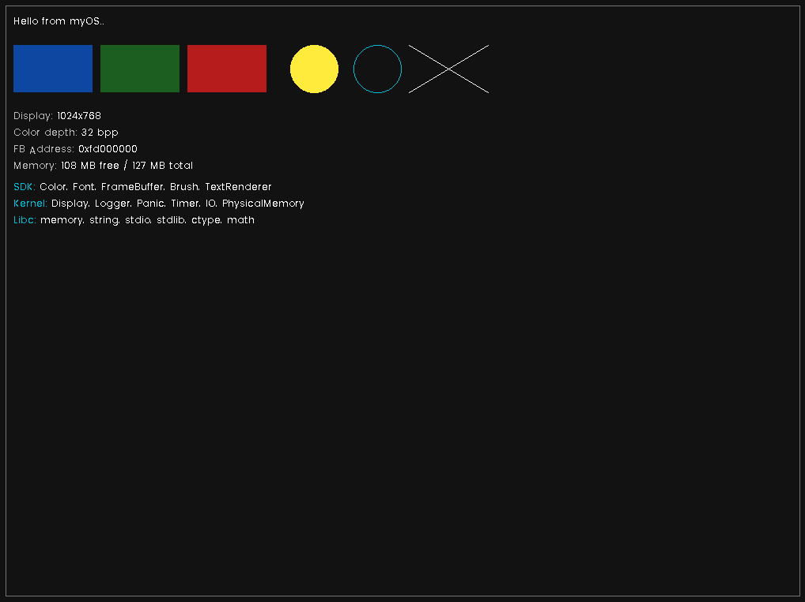

# myOS - Operating System Development Template

A professional, well-structured template for building x86 operating systems from scratch.

**Skip the boring setup.** This template provides a fully configured, bootable foundation so you can jump straight into OS development and exploration, without wasting hours trying to get a "Hello World" kernel to boot.

## Features

- **Multiboot2 Compliant**: Boots with GRUB2 bootloader
- **Framebuffer Graphics**: Double-buffered VGA/VBE graphics support
- **SDK Architecture**: Clean separation between kernel and userspace-ready components
- **Physical Memory Manager**: Bitmap-based page frame allocator
- **Serial Logging**: Debug output via COM1 serial port
- **Timer Support**: PIT-based delay functions
- **Kernel Panic Handler**: Graphical panic screen with serial logging
- **Custom Libc**: Freestanding implementations of memory, string, stdio, math functions
- **Build System**: CMake with cross-compilation support
- **Font Rendering**: Built-in Poppins bitmap font (expandable via `scripts/export_glyphs.py`)

## Screenshots



## Project Structure

```plain
os_template/
├── myOS/                       # Main OS source
│   ├── arch/x86/               # x86 architecture code
│   │   ├── boot/multiboot.asm  # Multiboot2 header and entry
│   │   └── include/            # Multiboot2 structures
│   ├── kernel/                 # Kernel-only code (ring 0)
│   │   ├── core/               # Main kernel logic
│   │   │   ├── Kernel.cpp      # Kernel initialization
│   │   │   ├── panic.cpp       # Panic handler
│   │   │   ├── Timer.cpp       # PIT timer
│   │   │   └── memory/         # Physical memory manager
│   │   └── include/            # Kernel headers
│   ├── sdk/                    # SDK (usable by userspace too)
│   │   ├── src/                # Color, Font, Brush, TextRenderer
│   │   └── include/            # Public SDK headers
│   ├── libs/                   # Libc implementation
│   │   ├── src/                # memory, string, stdio, stdlib, math
│   │   └── include/            # Libc headers
│   ├── linker/x86.ld           # Linker script
│   └── platform/grub/grub.cfg  # GRUB configuration
├── cmake/                      # CMake modules
│   ├── toolchains/             # Cross-compiler toolchains
│   ├── kernel-flags.cmake      # Compiler flags
│   └── iso.cmake               # ISO creation
├── scripts/                    # Utility scripts
│   └── export_glyphs.py        # Font glyph generator
├── build.py                    # Build automation script
├── configure.py                # Project renaming script
└── README.md
```

## Tools & Requirements

### Linux (Ubuntu/Debian)

```bash
# GCC 12 Compiler (GCC 13+ restricts freestanding containers)
sudo apt install build-essential g++-12 g++-12-multilib

# NASM Assembler
sudo apt install nasm

# Xorriso (ISO creation)
sudo apt install xorriso

# GRUB tools
sudo apt install grub-pc-bin grub-common grub2-common

# CMake
sudo apt install cmake

# QEMU (optional, for testing)
sudo apt install qemu-system-x86
```

### Windows

Use Windows Subsystem for Linux (WSL2) with Ubuntu, then follow Linux instructions.

## Quick Start

### 1. Clone the Repository

```sh
git clone https://github.com/MustafaAlotbah/myOS-template.git
cd myOS-template
```

### 2. Configure Your Project Name (Optional)

```sh
python3 configure.py --name YourOSName --author "Your Name"
```

### 3. Build the OS

```sh
python3 build.py --rebuild
```

### 4. Run in QEMU

```sh
python3 build.py --run
```

Or manually:

```sh
qemu-system-i386 -cdrom bin/myOS.iso -serial stdio
```

## Build Options

```bash
python3 build.py --help

Options:
  --configure    Configure CMake (first time setup)
  --build        Build the project
  --rebuild      Clean + Configure + Build
  --clean        Remove build artifacts
  --run          Run in QEMU
  --graph        Generate dependency graph
```

## Output Files

```plain
bin/
├── kernel.bin              # Raw kernel binary
├── myOS.iso                # Bootable ISO image
└── lib/
    ├── libmyos-sdk.a       # SDK static library
    └── libmyos-libc.a      # Libc static library
```

---

## Usage Guide

This section shows how to use the built-in components in your kernel code.

### Kernel Context

All kernel subsystems are accessible through the `kernel()` function:

```cpp
#include <myOS/kernel/Kernel.h>

void example() {
    Kernel& k = kernel();
    
    // Access subsystems
    k.logger;         // Serial logging
    k.timer;          // PIT timer
    k.display;        // Framebuffer display
    k.framebuffer;    // Raw framebuffer access
    k.brush;          // Drawing primitives
    k.textRenderer;   // Text rendering
    k.physicalMemory; // Page frame allocator
}
```

### Logger (Serial Debugging)

Output debug messages to COM1 serial port:

```cpp
#include <myOS/kernel/Logger.h>

LOG_ERROR("Critical error: %s", errorMsg);
LOG_WARN("Warning: value is %d", value);
LOG_INFO("Initialization complete");
LOG_DEBUG("Debug: pointer = 0x%x", ptr);
LOG_TRACE("Entering function %s", __func__);
```

Capture output with QEMU:
```bash
qemu-system-i386 -cdrom bin/myOS.iso -serial stdio
```

### Timer (Delays)

Use the PIT-based timer for delays:

```cpp
#include <myOS/kernel/Timer.h>

// Delay for 1 second
delay_ms(1000);

// Delay for 500 microseconds
delay_us(500);
```

### FrameBuffer

Direct pixel manipulation on the display:

```cpp
#include <myOS/FrameBuffer.h>

FrameBuffer& fb = kernel().display->getFrameBuffer();

// Set a single pixel
fb.setPixel(100, 100, Color::Red);

// Get framebuffer dimensions
uint32_t width = fb.getWidth();
uint32_t height = fb.getHeight();

// Clear the entire framebuffer
fb.clear(Color::Black);
```

### Brush (Drawing Primitives)

Draw shapes on the framebuffer:

```cpp
#include <myOS/Brush.h>

Brush brush(*kernel().framebuffer);

// Draw a filled rectangle
brush.fillRect(10, 10, 200, 100, Color::Blue);

// Draw a rectangle outline
brush.drawRect(10, 10, 200, 100, Color::White);

// Draw a line
brush.drawLine(0, 0, 100, 100, Color::Green);

// Draw a circle
brush.drawCircle(150, 150, 50, Color::Yellow);

// Draw a filled circle
brush.fillCircle(150, 150, 50, Color::Cyan);

// Draw a single pixel
brush.drawPixel(50, 50, Color::Red);
```

### TextRenderer

Render text with bitmap fonts:

```cpp
#include <myOS/TextRenderer.h>
#include <myOS/Font.h>

TextRenderer text(*kernel().framebuffer, Font::Poppins);

// Set text area position and size
text.setPosition(20, 20);
text.setSize(400, 300);

// Stream-style text output with colors
text << Color::White << "Hello, World!\n"
     << Color::Green << "Status: OK\n"
     << Color::Gray400 << "Value: " << 42 << "\n";

// Print numbers in different formats
text << TextRenderer::NumeralSystem::Hex << 255;  // "0xFF"
text << TextRenderer::NumeralSystem::Dec << 255;  // "255"
text << TextRenderer::NumeralSystem::Bin << 255;  // "0b11111111"

// Swap buffers (if double-buffered)
text << TextRenderer::Command::SwapBuffers;

// Manual cursor control
text.setCursor(0, 0);  // Reset cursor to top-left of text area
```

### Display (Double Buffering)

Manage the display with double buffering:

```cpp
#include <myOS/kernel/Display.h>

Display& display = *kernel().display;

// Draw to back buffer using Brush/TextRenderer...
// ...

// Swap front and back buffers
display.swapBuffers();

// Get the underlying framebuffer
FrameBuffer& fb = display.getFrameBuffer();
```

### Physical Memory Manager

Allocate and free physical memory pages (4KB frames):

```cpp
#include <myOS/kernel/memory/PhysicalMemory.h>

auto& pmm = *kernel().physicalMemory;

// Allocate a single 4KB frame
void* frame = pmm.allocateFrame();
if (frame) {
    // Use the frame...
    
    // Free when done
    pmm.freeFrame(frame);
}

// Allocate multiple contiguous frames
void* frames = pmm.allocateFrames(4);  // 16KB

// Get memory statistics
uint32_t totalMB = pmm.getTotalMemory() / (1024 * 1024);
uint32_t freeMB = pmm.getFreeMemory() / (1024 * 1024);
uint32_t usedMB = pmm.getUsedMemory() / (1024 * 1024);

LOG_INFO("Memory: %u MB total, %u MB free, %u MB used", totalMB, freeMB, usedMB);
```

### Kernel Panic

Halt the system with an error message:

```cpp
#include <myOS/kernel/Panic.h>

// Simple panic with formatted message
KERNEL_PANIC("Out of memory!");

// With format arguments
KERNEL_PANIC("Invalid address: 0x%x", address);

// Direct panic call (includes file:line automatically with KERNEL_PANIC macro)
myOS::kernel::panic("Fatal error: %s", errorString);
```

The panic handler will:

1. Disable interrupts
2. Log the error to serial port
3. Display a graphical panic screen
4. Halt the CPU

### Colors

Use predefined colors or create custom ones:

```cpp
#include <myOS/Color.h>

// Predefined colors
Color::Black, Color::White, Color::Red, Color::Green, Color::Blue,
Color::Yellow, Color::Cyan, Color::Magenta, Color::Orange, Color::Pink,
Color::Gray100, Color::Gray200, Color::Gray300, Color::Gray400,
Color::Gray500, Color::Gray600, Color::Gray700, Color::Gray800, Color::Gray900

// Create custom colors
Color custom1(255, 128, 64);           // RGB
Color custom2(255, 128, 64, 200);      // RGBA
Color custom3 = Color::fromRGB(255, 128, 64);
Color custom4 = Color::fromARGB(200, 255, 128, 64);
Color custom5 = Color::fromHex(0xFF8040);
```

### Adding Custom Fonts

Use the glyph export script to add new fonts:

```bash
cd scripts

# Export Poppins at 14px
python3 export_glyphs.py --font ./Poppins-Regular.ttf --size 14 --family Poppins

# Export a custom font
python3 export_glyphs.py --font ./MyFont.ttf --size 12 --family MyFont --out myfont_12px.txt
```

Then integrate the output into `Font.cpp`.

---

## Memory Layout

```plain
0x00000000 - 0x000FFFFF : Low memory (1MB) - BIOS, IVT, VGA
0x00100000 - 0x00FFFFFF : Extended memory (15MB) - Available
0x01000000 - ...        : Kernel load address (16MB+)
```

## License

This project is licensed under the BSD-3-Clause License. See the [LICENSE](LICENSE) file for details.

**Important**: If you use this template, please retain the copyright notice in your source files:
```cpp
/**
 * Based on myOS Template by Mustafa Alotbah
 * https://github.com/MustafaAlotbah/myOS-template
 */
```

## Contributing

Contributions are welcome! Please:

1. Fork the repository
2. Create a feature branch
3. Submit a pull request

## Contact

**Author**: Mustafa Alotbah  
**Email**: [mustafa.alotbah@gmail.com](mailto:mustafa.alotbah@gmail.com)  
**GitHub**: [https://github.com/MustafaAlotbah](https://github.com/MustafaAlotbah)

## Acknowledgments

- OSDev Wiki community for invaluable resources
- GRUB developers for the bootloader
- GCC and NASM teams for the toolchain
